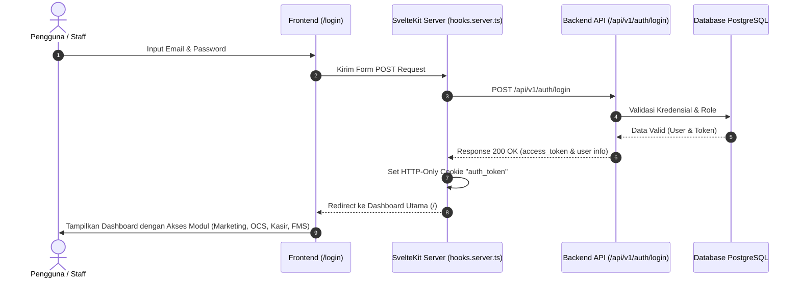

# 🔄 Alur Bisnis ERP BCS Logistics

Dokumen ini menjelaskan alur bisnis terintegrasi pada sistem ERP BCS Logistics, berfokus pada **Login Flow** dan **4 Modul Utama** yaitu: **Marketing, OCS (Operations Control System), Kasir, dan FMS (Fleet Management System)**.

---

## 1. Alur Login & Autentikasi (Login Flow)

Sistem menggunakan SvelteKit server-side authentication dengan HTTP-only Cookie (`auth_token`). Akses ke modul-modul dibatasi berdasarkan session token yang valid.

### Diagram Alur Login



---

## 2. Alur Bisnis Utama End-to-End (E2E Business Flow)

Alur bisnis ERP berpusat pada siklus hidup **Sales Order (SO)**, dimulai dari inisiasi oleh tim Marketing hingga penyelesaian keuangan oleh Kasir.

### Diagram Alur Utama (End-to-End)

```mermaid
flowchart TD
    %% Styling
    classDef marketing fill:#ffe4e6,stroke:#f43f5e,stroke-width:2px,color:#881337;
    classDef ocs fill:#e0f2fe,stroke:#0284c7,stroke-width:2px,color:#0c4a6e;
    classDef kasir fill:#dcfce7,stroke:#16a34a,stroke-width:2px,color:#064e3b;
    classDef fms fill:#eff6ff,stroke:#2563eb,stroke-width:2px,color:#1e3a8a;
    classDef driver fill:#fafaf9,stroke:#78716c,stroke-width:2px,color:#44403c;
    classDef startEnd fill:#f5f5f4,stroke:#a8a29e,stroke-width:2px;

    %% Nodes
    Start([Mulai]) --> M1
    
    %% Marketing
    subgraph Marketing Module
        M1[Buat Sales Order<br/><i>Status: WAITING_UJO</i>] :::marketing
        M3[Input Tarif & Kirim ke Customer<br/><i>Status: WAITING_CUSTOMER</i>] :::marketing
        M4[Konfirmasi Customer (Deal)<br/><i>Status: READY_TO_DISPATCH</i>] :::marketing
    end

    %% OCS
    subgraph OCS Module
        O1[Assign Unit & Driver + Input UJO<br/><i>Status: WAITING_TARIFF</i>] :::ocs
        O2[Finalisasi Dispatch<br/><i>Status: DISPATCHED</i>] :::ocs
        O3[Terima Surat Jalan & Input Realisasi<br/><i>Status: COMPLETED</i>] :::ocs
    end

    %% Kasir
    subgraph Kasir Module
        K1[Pencairan Uang Jalan (UJO)<br/><i>ujo_payment_status = PAID</i>] :::kasir
        K2[Pelunasan Biaya Tambahan<br/><i>closing_payment_status = PAID</i>] :::kasir
    end

    %% Driver Execution
    subgraph Driver Journey
        D1[Ambil Unit & Jalan ke Origin (Loading)] :::driver
        D2[Perjalanan ke Destination (Unloading)] :::driver
        D3[Kembali ke Pool (Bawa Surat Jalan)] :::driver
    end

    %% FMS Monitoring
    subgraph FMS (Fleet Management System)
        F1[Monitor Posisi Kendaraan & Live Map] :::fms
        F2[Update Status Ketersediaan Unit] :::fms
    end

    %% Flow Connections
    M1 --> O1
    O1 --> M3
    M3 --> M4
    M4 --> O2
    O2 --> K1
    K1 --> D1
    
    %% Driver Execution Cycle
    D1 --> D2
    D2 --> D3
    D3 --> O3
    
    %% Closing
    O3 --> K2
    K2 --> End([Selesai])

    %% Monitoring Links (Implicit)
    D1 -.-> F1
    D2 -.-> F1
    F2 -.-> M1
    F2 -.-> O1

    %% Legend
    style Start fill:#fafaf9,stroke:#78716c,stroke-width:1px
    style End fill:#fafaf9,stroke:#78716c,stroke-width:1px
```

---

## 3. Penjelasan Siklus Hidup Status Order (Sales Order Statuses)

Sistem melacak status order di tabel database `marketing.sales_order` dengan status transisi sebagai berikut:

| Status | Deskripsi | Modul Penanggung Jawab |
| :--- | :--- | :--- |
| `WAITING_UJO` | Order baru dibuat oleh Marketing, menunggu OCS menentukan Unit Truk, Supir, dan Uang Jalan (UJO). | **Marketing** (Inisiasi) |
| `WAITING_TARIFF` | OCS telah menetapkan Truk, Supir, dan input rincian UJO (Makan, Tol, Pokok). Menunggu Marketing menentukan tarif ke Customer. | **OCS** (Operational) |
| `WAITING_CUSTOMER` | Marketing telah mengisi nilai tarif penjualan ke Customer. Dokumen sedang ditinjau / menunggu persetujuan dari pihak Customer. | **Marketing** (Pricing) |
| `READY_TO_DISPATCH` | Customer menyetujui penawaran tarif. Order siap diberangkatkan oleh OCS. | **Marketing** (Confirmation) |
| `DISPATCHED` | OCS melakukan finalisasi dispatch. Permintaan bayar UJO terkirim ke Kasir. Truk mulai jalan. | **OCS** (Dispatch) |
| `COMPLETED` | Supir kembali membawa Surat Jalan. OCS melakukan closing dispatch dan menginput realisasi berat muatan & biaya tambahan. | **OCS** (Closing Dispatch) |
| `CANCELED` | Order dibatalkan oleh Marketing atau Customer. | **Marketing** / **System** |

---

## 4. Rincian Alur per Modul

Berikut adalah detail interaksi dan tanggung jawab spesifik pada masing-masing modul:

### A. Modul Marketing
Fokus utama Marketing adalah membuat pesanan, mengelola tarif untuk customer, dan memantau status persetujuan dari customer.

```mermaid
flowchart TD
    classDef marketing fill:#ffe4e6,stroke:#f43f5e,stroke-width:2px,color:#881337;
    classDef db fill:#f5f5f4,stroke:#78716c,stroke-width:2px;

    Start([Mulai]) --> A1[Pilih Customer] :::marketing
    A1 --> A2[Tentukan Rute: Origin & Destination] :::marketing
    A2 --> A3[Pilih Jenis Unit Truk] :::marketing
    A3 --> A4[Input Detail Muatan & Tanggal Kirim] :::marketing
    A4 --> A5[(Simpan Order Baru)] :::db
    A5 --> A6[Status: WAITING_UJO] :::marketing
    A6 --> A7[Tunggu OCS Assign Unit & UJO] :::marketing
    A7 --> A8[Dapatkan Estimasi UJO dari OCS] :::marketing
    A8 --> A9[Input Tarif Penjualan ke Customer] :::marketing
    A9 --> A10[Kirim Quotation ke Customer] :::marketing
    A10 --> A11{Customer Deal?} :::marketing
    A11 -- Ya --> A12[Konfirmasi Order] :::marketing
    A12 --> A13[Status: READY_TO_DISPATCH] :::marketing
    A11 -- Tidak --> A14[Batalkan / Edit Order] :::marketing
    A14 --> A15[Status: CANCELED] :::marketing
```

---

### B. Modul OCS (Operations Control System)
OCS berfokus pada operasional fisik: menetapkan kendaraan & supir, menghitung uang jalan (UJO), memantau kepulangan supir, dan melakukan pencatatan aktual pengiriman (surat jalan).

```mermaid
flowchart TD
    classDef ocs fill:#e0f2fe,stroke:#0284c7,stroke-width:2px,color:#0c4a6e;
    classDef db fill:#f5f5f4,stroke:#78716c,stroke-width:2px;

    Start([Terima Order WAITING_UJO]) --> B1[Pilih Unit Truk & Driver yang Tersedia] :::ocs
    B1 --> B2[Input Komponen UJO:<br/>1. Uang Makan<br/>2. Uang Tol<br/>3. Uang Pokok] :::ocs
    B2 --> B3[Status berubah: WAITING_TARIFF] :::ocs
    B3 --> B4[Tunggu Marketing Deal dengan Customer] :::ocs
    B4 --> B5[Terima Notifikasi: READY_TO_DISPATCH] :::ocs
    B5 --> B6[Klik Tombol Finalize & Send UJO] :::ocs
    B6 --> B7[Status berubah: DISPATCHED] :::ocs
    B7 --> B8[(Kirim Data UJO ke Kasir)] :::db
    B8 --> B9[Supir Jalan & Lakukan Pengiriman] :::ocs
    B9 --> B10[Supir Kembali & Serahkan Surat Jalan] :::ocs
    B10 --> B11[Klik Closing Dispatch] :::ocs
    B11 --> B12[Input Berat Aktual (Real Weight) & Beban Tambahan jika ada] :::ocs
    B12 --> B13[Status berubah: COMPLETED] :::ocs
    B13 --> B14[(Kirim Data Closing DN ke Kasir)] :::db
```

---

### C. Modul Kasir (Cash & Payment)
Kasir bertanggung jawab penuh terhadap aliran uang masuk dan keluar terkait operasional pengiriman (uang jalan supir dan penyelesaian biaya tambahan setelah closing).

```mermaid
flowchart TD
    classDef kasir fill:#dcfce7,stroke:#16a34a,stroke-width:2px,color:#064e3b;
    classDef db fill:#f5f5f4,stroke:#78716c,stroke-width:2px;

    Start([Mulai]) --> C1[Tinjau Antrean UJO di Fitur UJO] :::kasir
    C1 --> C2{Apakah Dispatch Sudah Finalized?} :::kasir
    C2 -- Belum --> C3[Data Belum Ditampilkan di Kasir] :::kasir
    C2 -- Sudah --> C4[Tampilkan Data UJO dengan status UNPAID] :::kasir
    C4 --> C5[Klik Tombol Cairkan] :::kasir
    C5 --> C6[Serahkan Uang Jalan Fisik ke Supir] :::kasir
    C6 --> C7[(Update Database:<br/>ujo_payment_status = PAID)] :::db

    %% Closing Section
    C7 --> C8[Tunggu OCS melakukan Closing Dispatch] :::kasir
    C8 --> C9[Tinjau Antrean Closing DN] :::kasir
    C9 --> C10[Periksa Selisih Tonnage & Beban Biaya Tambahan] :::kasir
    C10 --> C11[Klik Pelunasan / Closing DN] :::kasir
    C11 --> C12[(Update Database:<br/>closing_payment_status = PAID)] :::db
    C12 --> End([Selesai])
```

---

### D. Modul FMS (Fleet Management System)
FMS bertindak sebagai modul monitoring pasif dan manajemen aset. FMS melacak kondisi armada secara real-time dan mengelola data master armada.

```mermaid
flowchart TD
    classDef fms fill:#eff6ff,stroke:#2563eb,stroke-width:2px,color:#1e3a8a;

    Start([Mulai]) --> D1[Overview & Command Center] :::fms
    D1 --> D2[Live Map: Lacak Lokasi GPS Truk Real-Time] :::fms
    D1 --> D3[Route History: Riwayat Perjalanan Armada] :::fms
    D1 --> D4[Master Unit & Driver: Kelola Ketersediaan & Status] :::fms
    D1 --> D5[Maintenance & Service: Jadwal Oli, Ban, Sparepart] :::fms
    D1 --> D6[Fuel & Expenses Tracking] :::fms

    %% Hubungan ke modul lain
    D4 -.->|Kirim info unit siap jalan| Marketing:::fms
    D4 -.->|Kirim info unit siap jalan| OCS:::fms
```

---

## 5. Ringkasan Hubungan Antar Data di Database

Seluruh data transaksi di atas terhubung ke tabel `marketing.sales_order` sebagai tabel utama (single source of truth untuk transaksi pengiriman). Berikut skema hubungan kolomnya:

* **Truk & Supir** di-assign oleh **OCS** dan disimpan di:
  * `assigned_unit_id` (relasi ke tabel `fleet.unit`)
  * `assigned_driver_id` (relasi ke tabel `master.m_drivers`)
* **Uang Jalan Operasional (UJO)** di-input oleh **OCS**, dikonfirmasi **Marketing**, dan dicairkan oleh **Kasir**:
  * `ujo_makan` & `ujo_tol` (diset oleh OCS)
  * `estimated_ujo` (total uang jalan pokok + makan + tol)
  * `ujo_payment_status` (UNPAID -> PAID saat dicairkan Kasir)
* **Tarif Penjualan** diset oleh **Marketing**:
  * `tariff` (harga jual ke customer)
* **Closing / Kepulangan Truk** di-input oleh **OCS** dan dibayarkan oleh **Kasir**:
  * `real_weight` (berat aktual bongkar)
  * `extra_cost` & `extra_cost_desc` (tambahan biaya tak terduga di jalan)
  * `closing_payment_status` (UNPAID -> PAID setelah diselesaikan Kasir).
