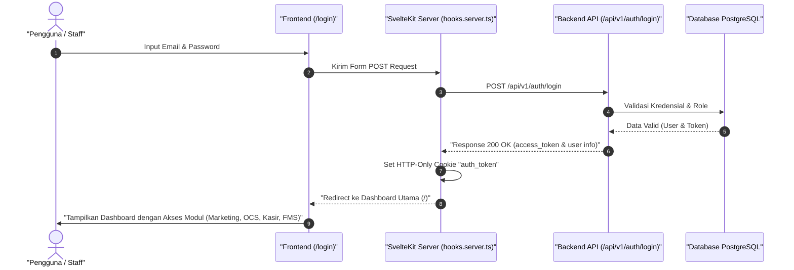
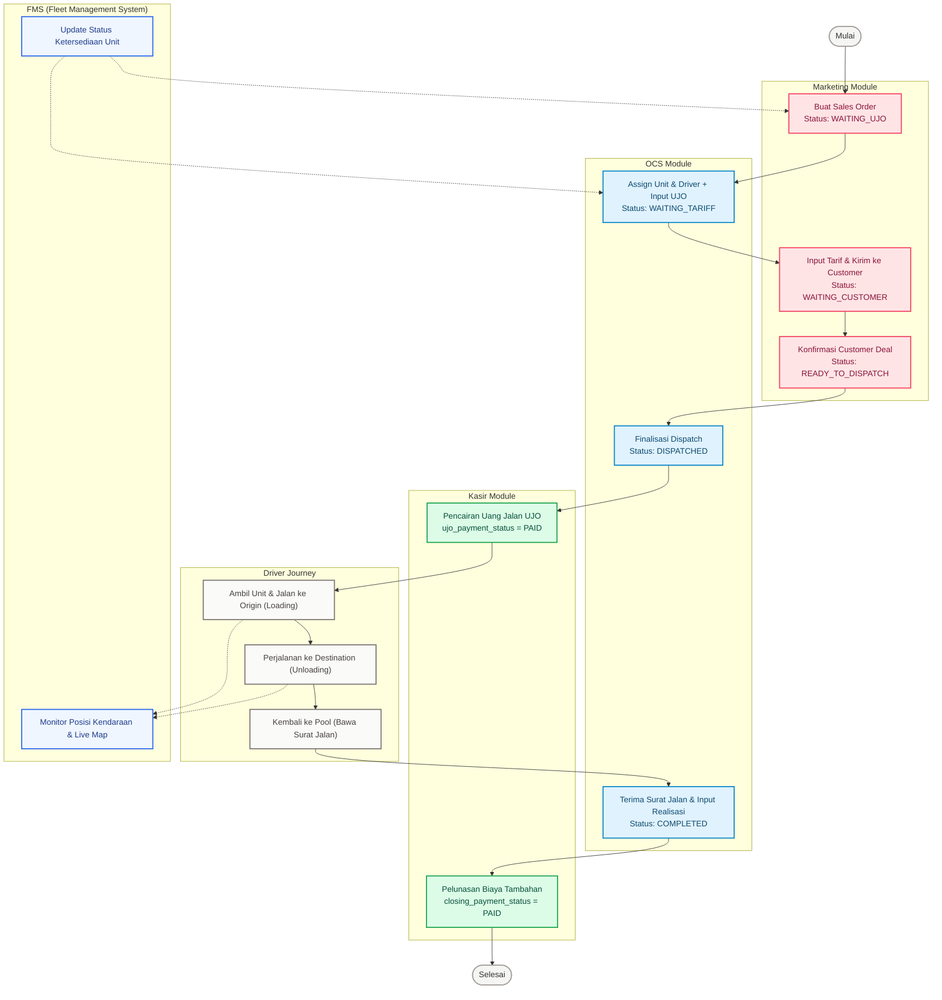
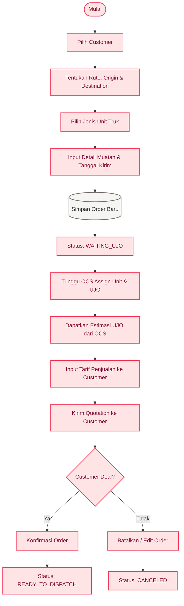
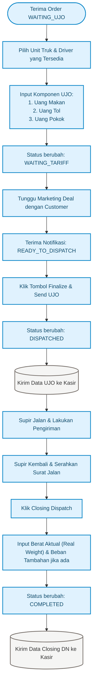
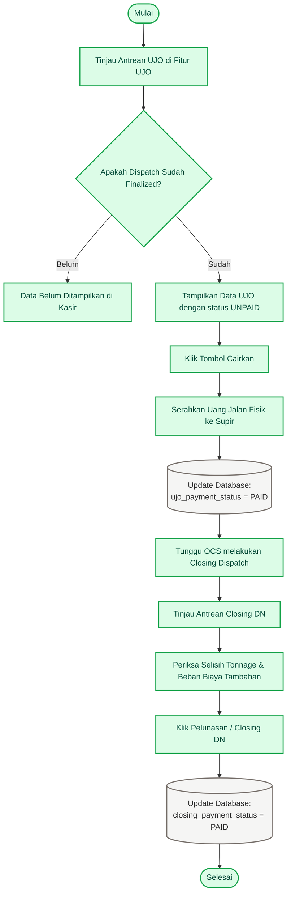
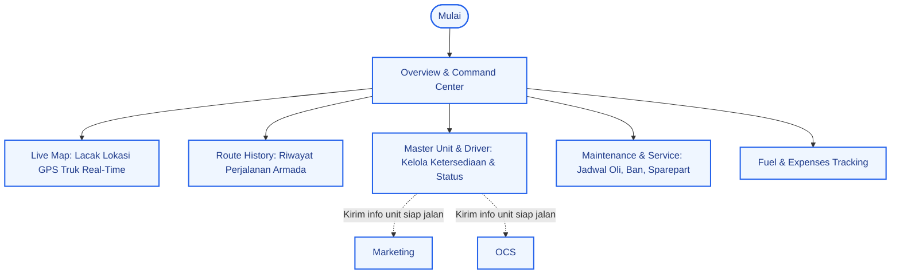

# 🔄 Alur Bisnis ERP BCS Logistics

Dokumen ini menjelaskan alur bisnis terintegrasi pada sistem ERP BCS Logistics, berfokus pada **Login Flow** dan **4 Modul Utama** yaitu: **Marketing, OCS (Operations Control System), Kasir, dan FMS (Fleet Management System)**.

---

## 1. Alur Login & Autentikasi (Login Flow)

Sistem menggunakan SvelteKit server-side authentication dengan HTTP-only Cookie (`auth_token`). Akses ke modul-modul dibatasi berdasarkan session token yang valid.

### Diagram Alur Login

---

## 2. Alur Bisnis Utama End-to-End (E2E Business Flow)

Alur bisnis ERP berpusat pada siklus hidup **Sales Order (SO)**, dimulai dari inisiasi oleh tim Marketing hingga penyelesaian keuangan oleh Kasir.

### Diagram Alur Utama (End-to-End)

---

## 3. Penjelasan Siklus Hidup Status Order (Sales Order Statuses)

Sistem melacak status order di tabel database `marketing.sales_order` dengan status transisi sebagai berikut:

| Status | Deskripsi | Modul Penanggung Jawab |
| :--- | :--- | :--- |
| `WAITING_UJO` | Order baru dibuat oleh Marketing, menunggu OCS menentukan Unit Truk, Supir, dan Uang Jalan (UJO). | **Marketing** (Inisiasi) |
| `WAITING_TARIFF` | OCS telah menetapkan Truk, Supir, dan input rincian UJO (Makan, Tol, Pokok). Menunggu Marketing menentukan tarif ke Customer. | **OCS** (Operational) |
| `WAITING_CUSTOMER` | Marketing telah mengisi nilai tarif penjualan ke Customer. Dokumen sedang ditinjau / menunggu persetujuan dari pihak Customer. | **Marketing** (Pricing) |
| `READY_TO_DISPATCH` | Customer menyetujui penawaran tarif. Order siap diberangkatkan oleh OCS. | **Marketing** (Confirmation) |
| `DISPATCHED` | OCS melakukan finalisasi dispatch. Permintaan bayar UJO terkirim ke Kasir. Truk mulai jalan. | **OCS** (Dispatch) |
| `COMPLETED` | Supir kembali membawa Surat Jalan. OCS melakukan closing dispatch dan menginput realisasi berat muatan & biaya tambahan. | **OCS** (Closing Dispatch) |
| `CANCELED` | Order dibatalkan oleh Marketing atau Customer. | **Marketing** / **System** |

---

## 4. Rincian Alur per Modul

Berikut adalah detail interaksi dan tanggung jawab spesifik pada masing-masing modul:

### A. Modul Marketing
Fokus utama Marketing adalah membuat pesanan, mengelola tarif untuk customer, dan memantau status persetujuan dari customer.

---

### B. Modul OCS (Operations Control System)
OCS berfokus pada operasional fisik: menetapkan kendaraan & supir, menghitung uang jalan (UJO), memantau kepulangan supir, dan melakukan pencatatan aktual pengiriman (surat jalan).

---

### C. Modul Kasir (Cash & Payment)
Kasir bertanggung jawab penuh terhadap aliran uang masuk dan keluar terkait operasional pengiriman (uang jalan supir dan penyelesaian biaya tambahan setelah closing).

---

### D. Modul FMS (Fleet Management System)
FMS bertindak sebagai modul monitoring pasif dan manajemen aset. FMS melacak kondisi armada secara real-time dan mengelola data master armada.

---

## 5. Ringkasan Hubungan Antar Data di Database

Seluruh data transaksi di atas terhubung ke tabel `marketing.sales_order` sebagai tabel utama (single source of truth untuk transaksi pengiriman). Berikut skema hubungan kolomnya:

* **Truk & Supir** di-assign oleh **OCS** dan disimpan di:
  * `assigned_unit_id` (relasi ke tabel `fleet.unit`)
  * `assigned_driver_id` (relasi ke tabel `master.m_drivers`)
* **Uang Jalan Operasional (UJO)** di-input oleh **OCS**, dikonfirmasi **Marketing**, dan dicairkan oleh **Kasir**:
  * `ujo_makan` & `ujo_tol` (diset oleh OCS)
  * `estimated_ujo` (total uang jalan pokok + makan + tol)
  * `ujo_payment_status` (UNPAID -> PAID saat dicairkan Kasir)
* **Tarif Penjualan** diset oleh **Marketing**:
  * `tariff` (harga jual ke customer)
* **Closing / Kepulangan Truk** di-input oleh **OCS** dan dibayarkan oleh **Kasir**:
  * `real_weight` (berat aktual bongkar)
  * `extra_cost` & `extra_cost_desc` (tambahan biaya tak terduga di jalan)
  * `closing_payment_status` (UNPAID -> PAID setelah diselesaikan Kasir).
