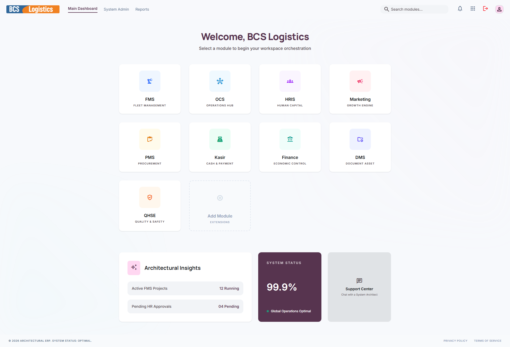

# 🖥️ Dashboard Portal Utama

Setelah Anda berhasil login, Anda akan disambut oleh halaman **Welcome Portal** atau **Dashboard Portal Utama**. Halaman ini berfungsi sebagai gerbang sentral untuk mengakses berbagai aplikasi/modul khusus yang ada di dalam ERP BCS Labs.

---

## 📸 Tampilan Dashboard Utama

Dashboard portal dirancang dengan antarmuka bergaya kartu modern (*card layout*) yang bersih dan responsif, memudahkan pengguna untuk beralih antar aplikasi dengan sekali klik.

---

## ⚙️ Modul Aplikasi yang Tersedia

ERP BCS Labs terdiri dari **9 Modul Utama** yang saling terintegrasi:

| Nama Aplikasi | Nama Modul | Deskripsi Singkat |
| :--- | :--- | :--- |
| 🛞 **FMS** | *Fleet Management System* | Manajemen operasional armada, kendaraan, pengemudi, rute perjalanan, konsumsi BBM, servis berkala, dan laporan insiden. |
| 🌐 **OCS** | *Operations Hub* | Pusat koordinasi operasional pengiriman (dispatch), penugasan driver, pemantauan status, dan pencairan dana jalan (UJO). |
| 👥 **HRIS** | *Human Capital* | Manajemen data karyawan, absensi, persetujuan pengajuan cuti, penilaian kinerja karyawan, dan siklus kerja. |
| 📢 **Marketing** | *Growth Engine* | Manajemen hubungan pelanggan (CRM), pembuatan master kontrak/PO, pengelolaan order pengiriman (DO), dan laporan penjualan. |
| 📦 **PMS** | *Procurement Management* | Manajemen pengadaan barang, master barang (Item), data pemasok (Supplier), Purchase Order (PO), stok gudang, dan pemeliharaan alat. |
| 💵 **Kasir** | *Cash & Payment* | Pengelolaan kas kasir, pencairan Uang Jalan Driver (UJO), penagihan invoice pelanggan, pencatatan pengeluaran, dan arus kas harian. |
| 🏦 **Finance** | *Economic Control* | Kontrol keuangan tingkat korporat, validasi invoice, pencatatan biaya operasional (expenses), analisis keuntungan, dan laporan keuangan komprehensif. |
| 📂 **DMS** | *Document Asset* | Sistem penyimpanan dan pengarsipan berkas dokumen penting perusahaan secara terstruktur dan aman. |
| 🛡️ **QHSE** | *Quality & Safety* | Manajemen standar mutu pelayanan, keselamatan kerja, kesehatan lingkungan, dan audit internal. |

---

## 🧭 Cara Navigasi Antar Modul

1. Di halaman Dashboard Portal Utama, pilih salah satu kartu modul (misalnya **HRIS** atau **FMS**).
2. Klik pada kartu tersebut. Aplikasi akan terbuka di halaman baru atau tab baru.
3. Untuk kembali ke Dashboard Portal Utama sewaktu-waktu, klik menu **Main Dashboard** yang terletak di bilah navigasi bagian kiri atas halaman modul apa pun.
4. Anda juga dapat menggunakan pintasan navigasi cepat atau tombol profil untuk melakukan logout.

---

> [!TIP]
> Setiap modul ERP dirancang memiliki hak akses khusus. Jika modul tertentu tidak dapat diklik atau diakses, hubungi **Administrator IT** untuk memperbarui peran (*role*) dan hak akses (*permissions*) akun Anda.
