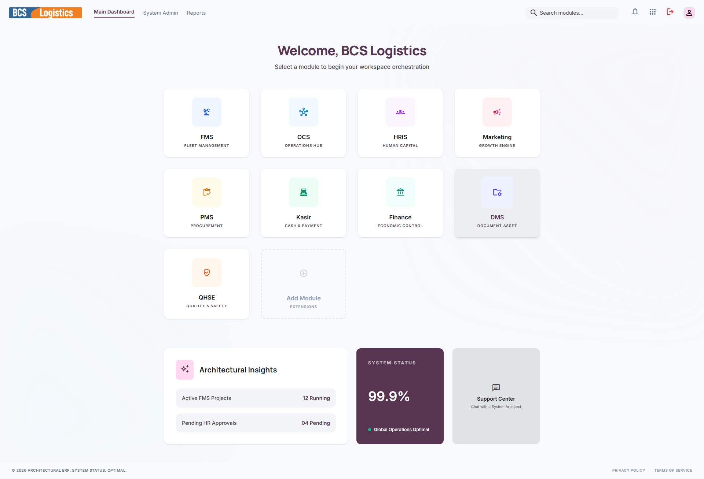

# 📂 DMS (Document Asset)

**Document Management System (DMS)** atau **Document Asset** adalah modul penyimpanan berkas dan arsip digital perusahaan secara terpusat, aman, dan terstruktur. Aplikasi ini dirancang untuk mengurangi penggunaan kertas fisik (*paperless*), meminimalisir risiko kehilangan dokumen, serta mempermudah pencarian berkas penting kapan pun dibutuhkan oleh berbagai departemen.

---

## 📸 Tampilan Utama Modul DMS

Penyimpanan arsip digital di modul DMS dirancang dengan sistem struktur direktori folder yang intuitif.

---

## 🧭 Menu dan Fitur DMS

Modul DMS memfokuskan fiturnya pada keandalan penyimpanan berkas operasional dengan menu utama berikut:

### 1. Document Dashboard (Dashboard Dokumen)
Menyajikan daftar folder berkas berdasarkan kategori departemen (misal: Folder HRD, Folder Operasional Armada, Folder Kontrak Penjualan, Folder Pajak & Keuangan). Menyediakan bilah pencarian cerdas berbasis nama dokumen, tag, atau tanggal diunggah untuk mempercepat penemuan berkas.

---

### ⚙️ Fitur Utama DMS meliputi:
* **Struktur Folder Hierarkis**: Pengelompokan dokumen berdasarkan departemen (FMS, HRIS, Finance, Marketing, PMS) atau tahun arsip.
* **Kontrol Hak Akses Dokumen**: Administrator dapat membatasi siapa saja yang boleh melihat, mengunduh, mengedit, atau menghapus dokumen tertentu berdasarkan perannya.
* **Version Control (Riwayat Versi)**: Menyimpan riwayat perubahan berkas jika ada dokumen yang diperbarui, sehingga dokumen versi lama tidak hilang dan dapat di-restore kapan saja.
* **Keamanan Berkas**: Seluruh dokumen yang diunggah disimpan di cloud server yang terenkripsi aman.
