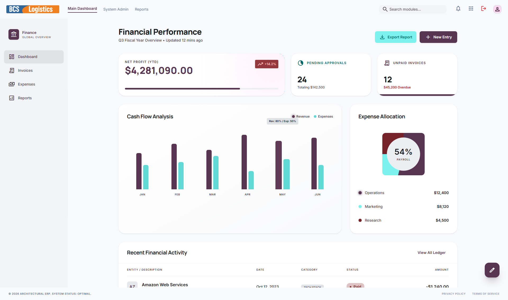

# 🏦 Finance (Economic Control)

Modul **Finance** (*Economic Control*) memegang peran kontrol makro terhadap kesehatan finansial perusahaan. Berbeda dengan Kasir yang melayani transaksi harian taktis, Finance fokus pada penyusunan anggaran, persetujuan tagihan/biaya besar (*approval*), audit transaksi harian kasir, analisis laporan laba rugi, neraca keuangan, perpajakan, serta laporan performa bisnis korporat secara keseluruhan.

---

## 📸 Tampilan Utama Modul Finance

Dashboard utama Finance menyajikan ringkasan visual tingkat tinggi mengenai performa keuangan korporasi.

---

## 🧭 Menu dan Fitur Finance

Modul Finance memiliki navigasi sidebar kiri yang terdiri dari menu-menu berikut:

### 1. Dashboard Keuangan
Menampilkan indikator performa keuangan utama (KPI) perusahaan, seperti rasio profitabilitas, total piutang yang belum tertagih (AR), total utang usaha (AP), tren pengeluaran bulanan, dan proyeksi kas perusahaan di masa depan.

---

### 2. Invoices (Validasi Piutang)
Menu untuk mengaudit seluruh invoice yang diterbitkan oleh departemen Marketing. Staf Finance memastikan keakuratan perhitungan tarif rute, PPN/PPH jasa logistik, melakukan peninjauan kontrak kerja sama sebelum tagihan tersebut dikirimkan secara resmi ke pelanggan untuk ditagih.

---

### 3. Expenses (Verifikasi Biaya Usaha)
Menu rekonsiliasi dan verifikasi seluruh klaim biaya operasional (*expenses reimbursement*) yang diajukan oleh divisi FMS, OCS, HRIS, atau PMS. Finance memeriksa keabsahan bukti nota fisik belanja, menyetujui anggaran pengeluaran berskala besar, serta mengawasi realisasi anggaran divisi.

---

### 4. Reports (Laporan Keuangan & Laba Rugi)
Pusat pembuatan laporan keuangan akuntansi formal perusahaan. Dari menu ini, akuntan perusahaan merilis Laporan Laba Rugi (*Income Statement*), Laporan Posisi Keuangan (*Balance Sheet*), Laporan Perubahan Modal, Laporan Arus Kas Konsolidasi, serta perhitungan pajak bulanan/tahunan (PPH/PPN) secara akurat.

---

> [!NOTE]
> Seluruh Laporan Keuangan di modul Finance dihitung secara otomatis berdasarkan rekapitulasi data transaksi rill dari modul **Marketing** (penjualan), **Kasir** (arus kas harian), **PMS** (pembelian suku cadang), dan **HRIS** ( slip gaji karyawan).
