# 🛞 FMS (Fleet Management System)

**Fleet Management System (FMS)** adalah modul yang bertanggung jawab penuh terhadap pengelolaan seluruh aset armada kendaraan perusahaan. Modul ini membantu perusahaan logistik untuk memantau status kendaraan, efisiensi pengemudi, rute perjalanan, pengeluaran bahan bakar, perawatan armada, hingga penanganan insiden di lapangan secara terpusat.

---

## 📸 Tampilan Utama Modul FMS

Saat pertama kali masuk ke aplikasi FMS, Anda akan melihat tampilan dashboard khusus FMS yang menyajikan statistik ringkas mengenai armada Anda.

---

## 🧭 Menu dan Fitur FMS

Modul FMS memiliki bilah navigasi kiri (sidebar) yang terdiri dari fitur-fitur berikut:

### 1. Dashboard Overview
Menampilkan ringkasan visual berupa grafik, jumlah kendaraan aktif, pengemudi yang sedang bertugas, konsumsi bahan bakar kumulatif, serta notifikasi perawatan berkala yang harus segera dilakukan.

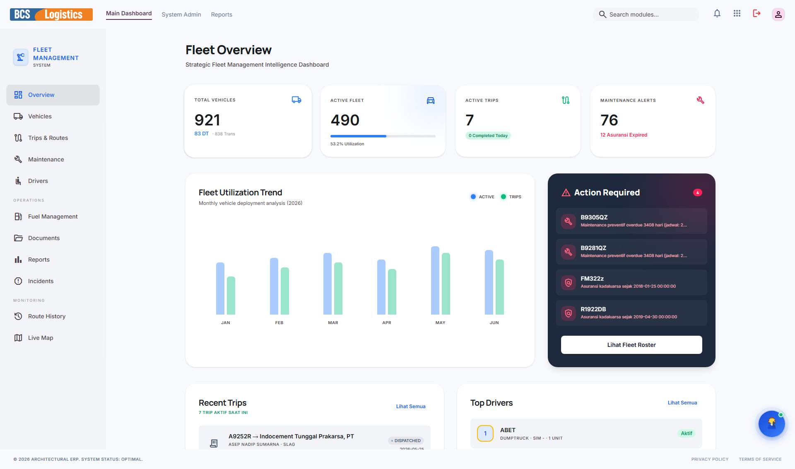

---

### 2. Vehicles (Kendaraan)
Menu ini memuat daftar seluruh aset kendaraan yang dimiliki perusahaan (Truk, Fuso, Wingbox, dll.). Berisi detail data seperti nomor polisi, merek, tipe, kapasitas angkut, status jalan/rusak, dan tanggal jatuh tempo STNK/KIR.

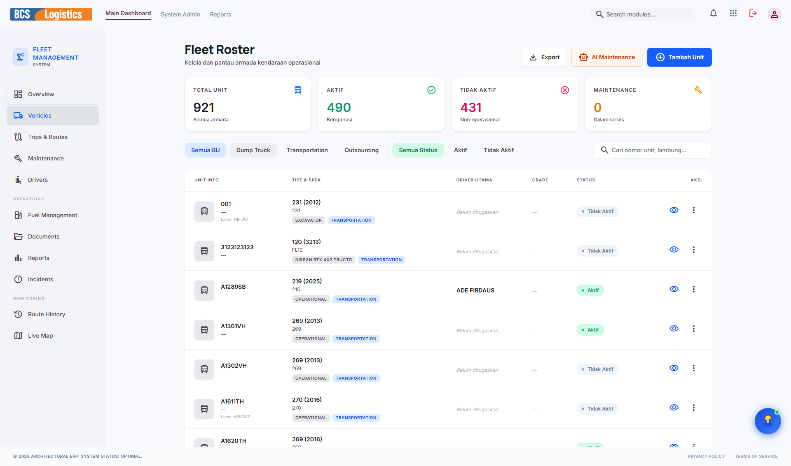

---

### 3. Drivers (Pengemudi)
Mengelola database pengemudi (driver) aktif. Berisi biodata lengkap pengemudi, foto, nomor telepon, status ketersediaan (tersedia/sedang jalan), sisa limit saldo jalan, dan masa berlaku Surat Izin Mengemudi (SIM).

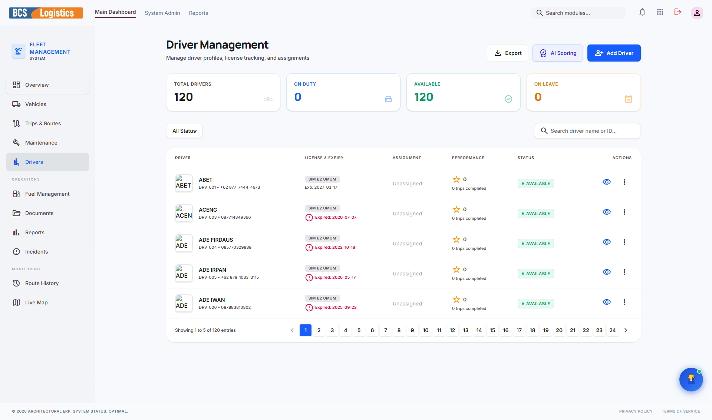

---

### 4. Routes (Rute Perjalanan)
Fitur untuk merencanakan dan mengelola titik koordinat rute pengiriman yang optimal. Anda dapat mendefinisikan rute standar dari titik asal (Origin) ke titik tujuan (Destination) beserta estimasi jarak tempuh dan waktu tempuh.

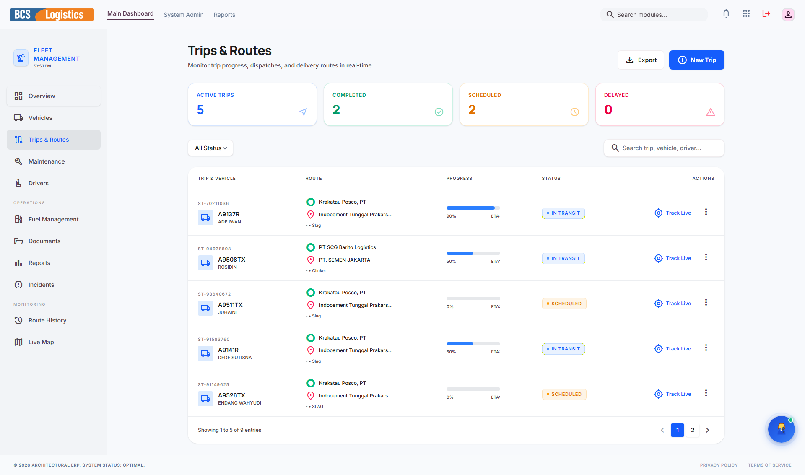

---

### 5. Route History (Riwayat Perjalanan)
Menyajikan tabel log riwayat perjalanan yang telah diselesaikan oleh armada. Berisi detail tanggal jalan, nomor lambung truk, nama driver, rute yang dilewati, serta waktu keberangkatan dan kedatangan aktual.

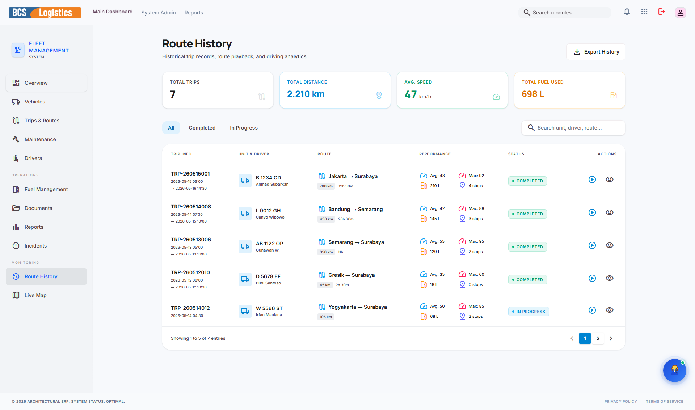

---

### 6. Live Map (Peta Langsung)
Mengintegrasikan modul pelacakan GPS secara real-time. Memungkinkan tim operasional memantau lokasi geografis truk saat ini di peta digital, kecepatan berkendara, serta memprediksi waktu ketibaan di lokasi tujuan.

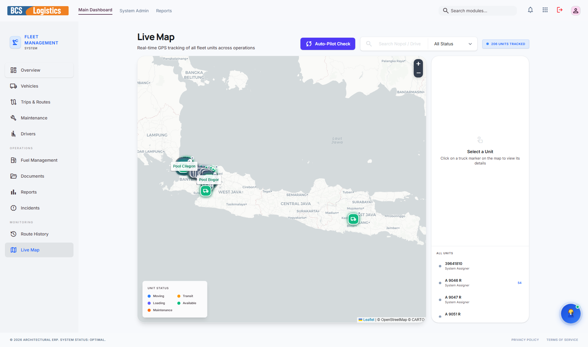

---

### 7. Fuel Management (Manajemen BBM)
Digunakan untuk memantau konsumsi bahan bakar setiap armada. Setiap transaksi pengisian BBM dicatat di sini (lokasi SPBU, jumlah liter, nominal uang, dan angka odometer) untuk menganalisis efisiensi bahan bakar per kilometer.

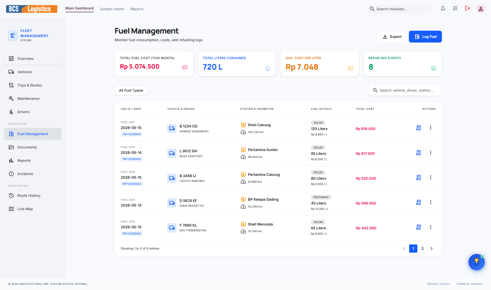

---

### 8. Maintenance (Pemeliharaan & Servis)
Mengelola jadwal servis berkala armada (ganti oli, servis rutin, penggantian ban, perbaikan mesin). Fitur ini memiliki pengingat otomatis berdasarkan kelipatan kilometer (odometer) atau rentang waktu tertentu.

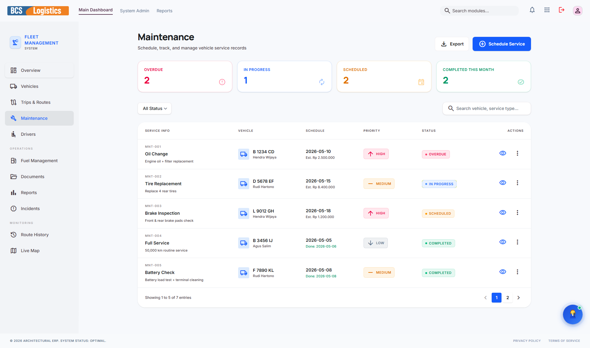

---

### 9. Incidents (Insiden Jalan)
Formulir pelaporan dan log pencatatan kejadian luar biasa di jalan raya (kecelakaan, mogok, ban pecah, kena tilang, dll.). Berisi deskripsi insiden, taksiran biaya kerugian, nama driver yang bertanggung jawab, serta penanganan yang telah dilakukan.

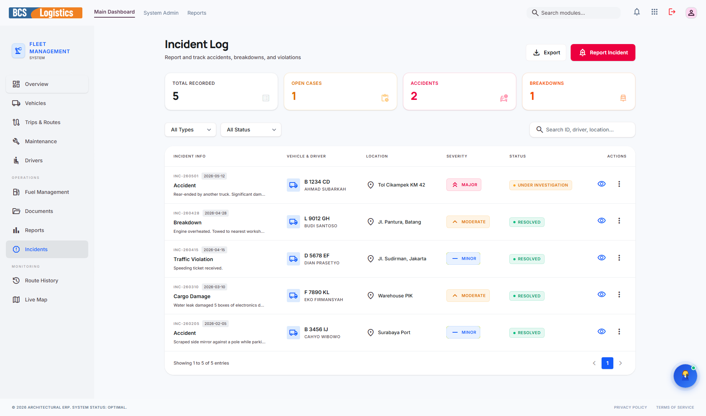

---

### 10. Documents (Pengarsipan Dokumen)
Penyimpanan berkas digital terkait legalitas armada seperti scan STNK, buku KIR, polis asuransi kendaraan, serta kontrak sewa armada jika ada. Membantu pelacakan masa aktif dokumen agar tidak terlambat diperpanjang.

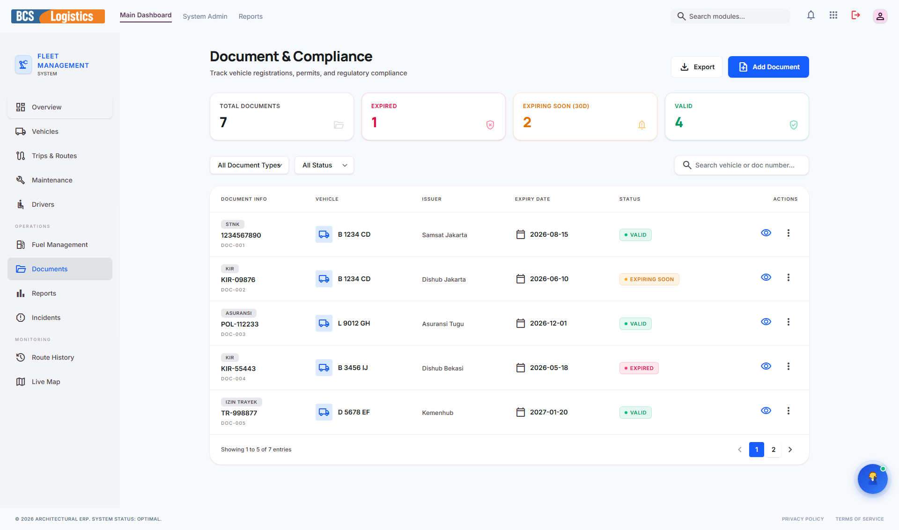

---

### 11. Reports (Laporan Analitik)
Menghasilkan laporan komprehensif bulanan/tahunan FMS. Laporan mencakup analisis efisiensi biaya perawatan truk, konsumsi BBM per armada, performa pengemudi, hingga laporan utilisasi armada untuk kebutuhan pengambilan keputusan manajemen.

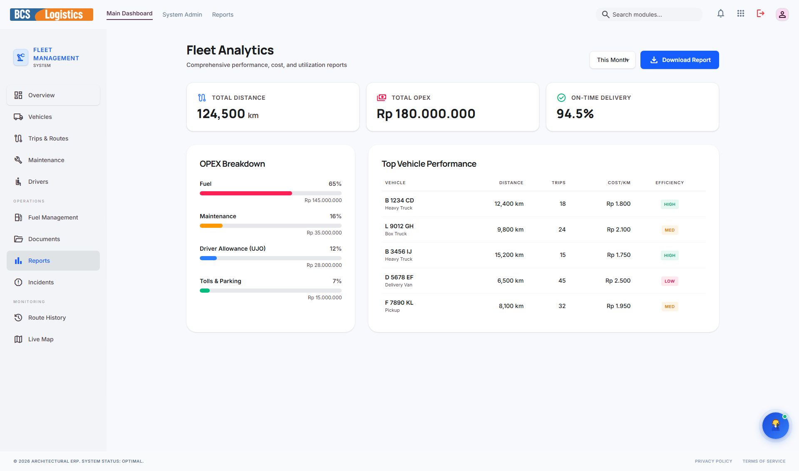

---

> [!NOTE]
> Seluruh menu di modul FMS saling terintegrasi secara otomatis dengan modul **OCS (Operations Hub)** untuk penugasan pengiriman dan modul **Kasir** untuk alokasi dana jalan (UJO) dan bahan bakar.
