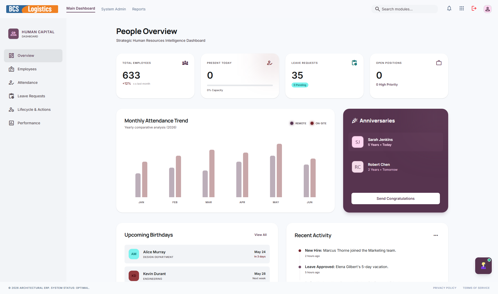
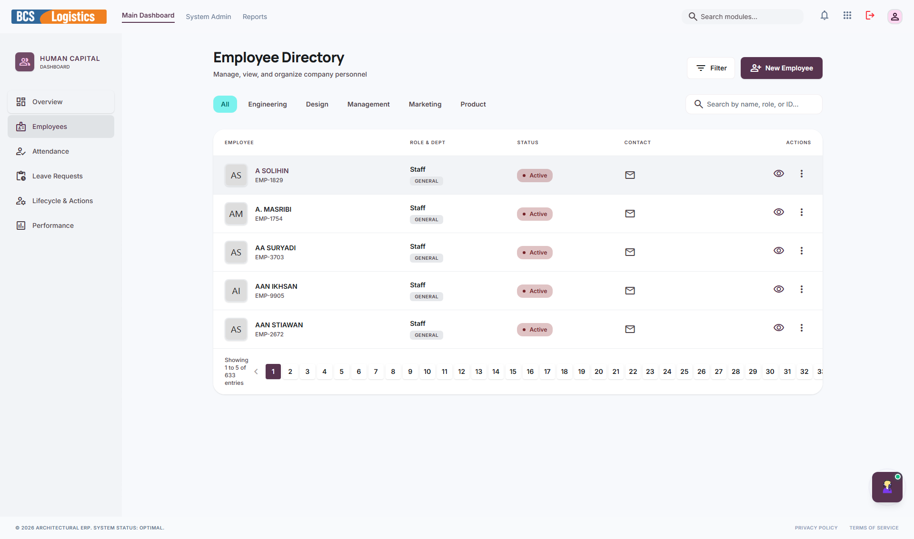
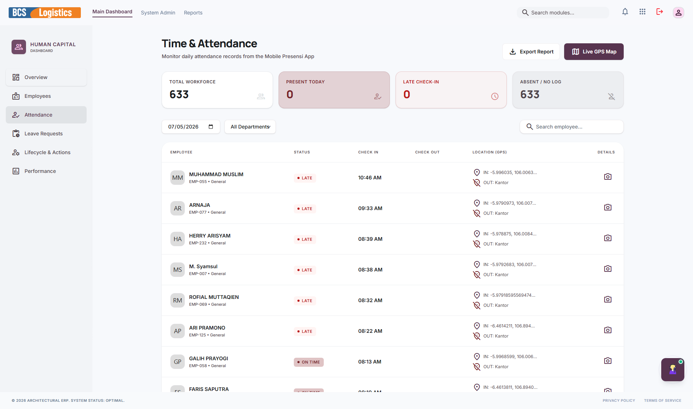
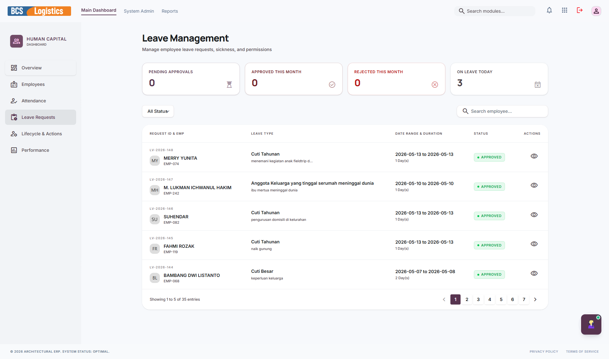
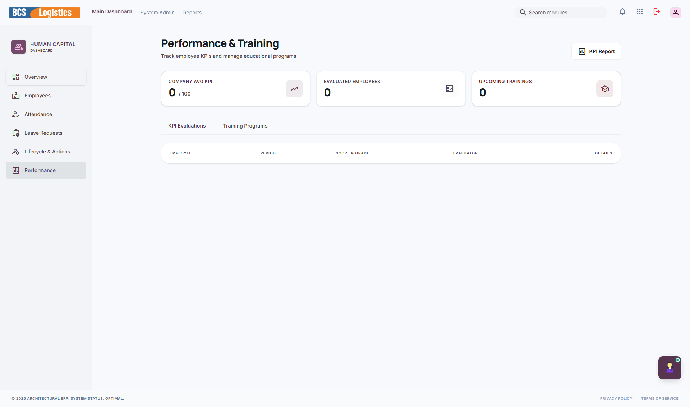
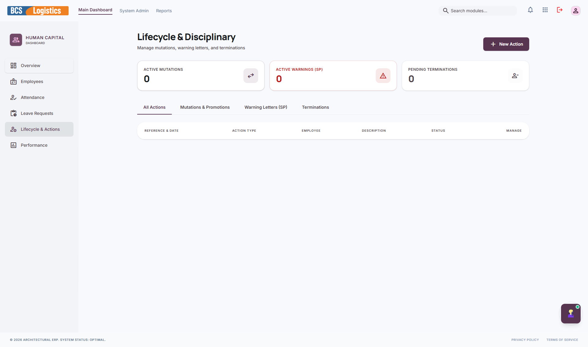

# 👥 HRIS (Human Capital)

**Human Resource Information System (HRIS)** atau **Human Capital** adalah modul yang didedikasikan untuk mengelola seluruh administrasi kepegawaian perusahaan secara digital. Modul ini membantu departemen HRD untuk memelihara database karyawan, mencatat kehadiran (absensi), memproses pengajuan cuti karyawan, melakukan penilaian kinerja berkala, serta mengelola siklus hidup akun karyawan.

---

## 📸 Tampilan Utama Modul HRIS

Halaman utama HRIS menampilkan portal HRD modern yang menyederhanakan pengelolaan administrasi kepegawaian.

---

## 🧭 Menu dan Fitur HRIS

Modul HRIS memiliki navigasi sidebar kiri yang terdiri dari menu-menu berikut:

### 1. Dashboard Overview
Menyajikan statistik kepegawaian terkini secara real-time seperti total karyawan aktif, persentase kehadiran hari ini, jumlah karyawan yang sedang cuti atau izin, serta grafik demografi usia atau divisi karyawan.

---

### 2. Employees (Karyawan)
Database pusat data karyawan perusahaan. Berisi riwayat hidup lengkap (nama, alamat, kontak), nomor induk karyawan (NIK), divisi/departemen, jabatan, golongan gaji, status kepegawaian (tetap/kontrak/magang), hingga riwayat karir karyawan di dalam perusahaan.

---

### 3. Attendance (Kehadiran & Absensi)
Mencatat dan memantau log kehadiran harian karyawan. Fitur ini merekam jam masuk, jam pulang, keterlambatan, jam kerja efektif, dan status ketidakhadiran (tanpa keterangan/sakit/izin/dinas luar). Terintegrasi dengan sistem presensi mandiri karyawan.

---

### 4. Leave Requests (Pengajuan Cuti)
Pusat manajemen pengajuan cuti dan izin karyawan. Karyawan mengajukan permohonan cuti secara online, dan tim HRD atau atasan langsung dapat menyetujui (*Approve*) atau menolak (*Reject*) pengajuan tersebut langsung melalui panel ini setelah memeriksa sisa kuota cuti tahunan karyawan yang bersangkutan.

---

### 5. Performance (Penilaian Kinerja)
Menu untuk mengelola evaluasi kinerja karyawan secara berkala (Key Performance Indicator / KPI). Digunakan untuk mencatat hasil penilaian kompetensi, target pencapaian kerja, feedback dari atasan, serta penentuan kelayakan promosi jabatan atau bonus tahunan.

---

### 6. Lifecycle Actions (Siklus Akun Karyawan)
Mengelola transisi status kepegawaian karyawan di dalam perusahaan secara teratur, seperti proses penerimaan karyawan baru (onboarding), mutasi jabatan/divisi, promosi, penurunan jabatan (demosi), hingga penanganan pengunduran diri atau pemutusan hubungan kerja (offboarding/termination).

---

> [!TIP]
> Integrasi absensi HRIS membantu mengotomatiskan rekap kehadiran bulanan yang digunakan oleh tim Finance sebagai dasar perhitungan slip gaji (*payroll*) secara akurat tanpa manipulasi data.
