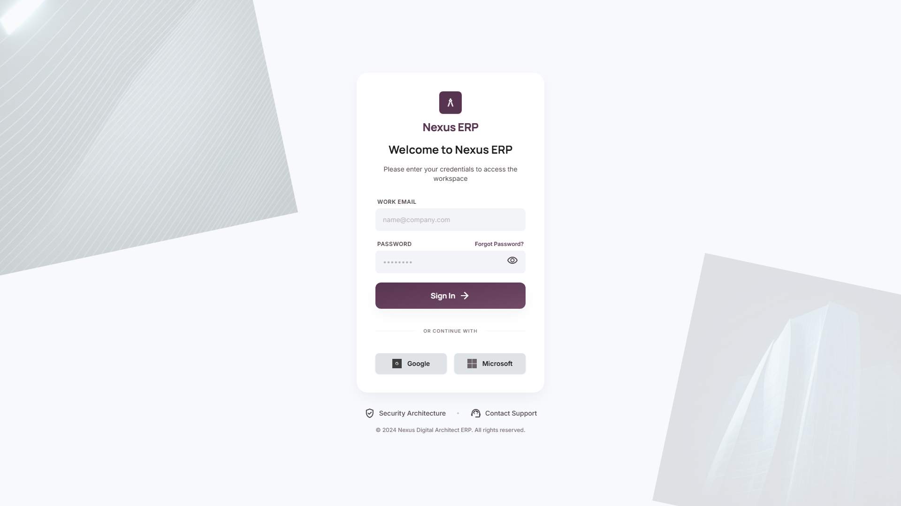

# Selamat Datang di Dokumentasi ERP BCS Labs

Sistem **Enterprise Resource Planning (ERP) BCS Labs** adalah platform terintegrasi yang dirancang khusus untuk mengelola seluruh aspek operasional bisnis secara efisien dan real-time. Mulai dari manajemen armada (FMS), pengelolaan operasional (OCS), manajemen sumber daya manusia (HRIS), pengadaan barang (PMS), hingga kontrol keuangan (Finance) dan kasir.

---

## 🔑 Akses Masuk Sistem

Untuk mengakses seluruh fitur ERP, Anda harus melakukan login terlebih dahulu melalui portal masuk resmi.

* **URL Portal Login**: [https://erp.bcslabs.tech/login](https://erp.bcslabs.tech/login)
* **Kredensial Default**:
    * **Email**: `acengsatu@gamil.com`
    * **Password**: `password123`

---

## 🖥️ Tampilan Awal Halaman Login

Berikut adalah tampilan antarmuka halaman login saat pertama kali diakses. Halaman ini dirancang bersih dan aman untuk memastikan kenyamanan pengguna saat masuk ke sistem.

### Langkah-Langkah Login:
1. Buka browser Anda dan kunjungi tautan portal login di atas.
2. Masukkan alamat **Email** Anda pada kolom yang disediakan.
3. Masukkan **Password** akun Anda dengan benar.
4. Klik tombol **Login** (atau tekan `Enter`).
5. Setelah berhasil, sistem akan mengarahkan Anda langsung ke **Dashboard Utama (Welcome Portal)**.

---

> [!NOTE]
> Pastikan koneksi internet Anda stabil dan gunakan browser modern seperti Google Chrome atau Microsoft Edge untuk pengalaman penggunaan terbaik.

> [!WARNING]
> Jangan pernah membagikan password atau kredensial login Anda kepada pihak lain demi menjaga keamanan data perusahaan.
