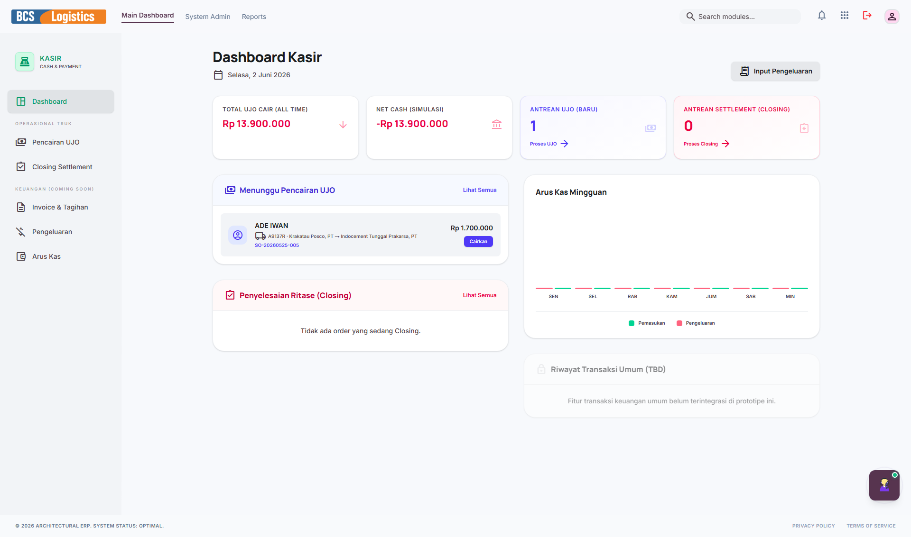
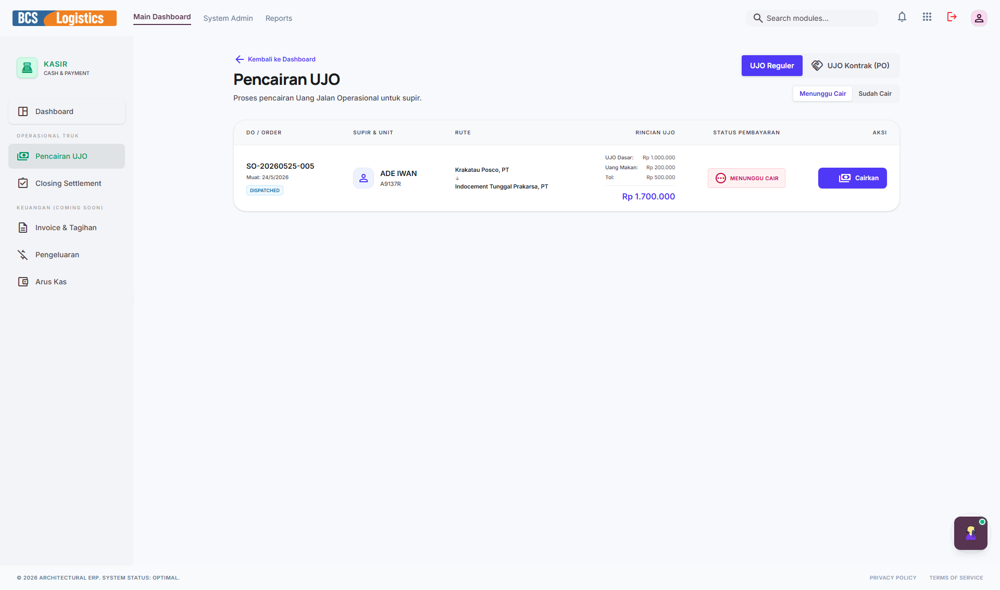
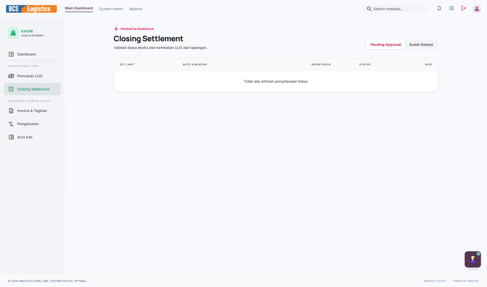

# 💵 Kasir (Cash & Payment)

Modul **Kasir** (*Cash & Payment*) adalah ujung tombak eksekusi transaksi keuangan harian operasional perusahaan secara taktis. Kasir memproses segala bentuk transaksi masuk dan keluar yang berskala harian, termasuk pencairan dana jalan sopir (UJO), penagihan tagihan/invoice yang jatuh tempo kepada pelanggan, pencatatan pengeluaran operasional taktis, analisis arus kas (*cash flow*), hingga penutupan kas harian (*Closing/Settlement*).

---

## 📸 Tampilan Utama Modul Kasir

Halaman kasir menyajikan antarmuka yang ramah pengguna untuk pengelolaan kas masuk dan kas keluar operasional harian.

---

## 🧭 Menu dan Fitur Kasir

Modul Kasir memiliki navigasi sidebar kiri yang terdiri dari menu-menu berikut:

### 1. Dashboard Kasir
Menyajikan status kas tunai terkini di brankas kasir, rangkuman pencairan UJO hari ini, daftar invoice yang telah lunas vs tertunggak, serta grafik perbandingan kas masuk dan keluar secara harian.

---

### 2. Pencairan UJO (Uang Jalan Operasional)
Menu khusus untuk memproses pembayaran Uang Jalan Operasional (UJO) bagi para driver yang akan melakukan perjalanan pengiriman barang. Kasir mencairkan dana ini berdasarkan perintah resmi dari modul **OCS (Operations Hub)** dan mencatatnya sebagai uang keluar dari kasir.

---

### 3. Invoice & Tagihan Pelanggan
Mengelola penagihan piutang usaha kepada pelanggan. Kasir dapat melihat daftar invoice yang diterbitkan oleh Marketing, mencatat pembayaran parsial atau pelunasan penuh dari pelanggan (baik tunai maupun transfer bank), serta memperbarui status tagihan menjadi *Paid* (Lunas).

---

### 4. Pengeluaran (Expenses)
Mencatat segala pengeluaran tunai/non-tunai harian yang bersifat taktis di kantor maupun di lapangan, seperti pembelian bensin cadangan driver, biaya parkir/toll tak terduga, biaya makan lembur staf operasional, atau pembelian perlengkapan kebersihan kantor.

---

### 5. Arus Kas (Cash Flow)
Log catatan kronologis komprehensif mengenai mutasi debit (kas masuk) dan kredit (kas keluar) kasir. Menampilkan saldo awal hari ini, total mutasi sepanjang hari, dan sisa saldo akhir hari secara detail per transaksi untuk kebutuhan akuntabilitas keuangan.

---

### 6. Closing & Settlement (Penutupan Kas)
Prosedur penutupan buku kas kasir setiap akhir jam kerja. Kasir melakukan pencocokan (*rekonsiliasi*) antara catatan kas di sistem dengan uang fisik yang ada di brankas. Staf kasir membuat laporan penutupan harian dan mengirimkannya ke tim **Finance** untuk diverifikasi.

---

> [!WARNING]
> Proses **Closing & Settlement** wajib dilakukan setiap hari tanpa pengecualian untuk mencegah selisih kas fisik dan menjaga transparansi keuangan perusahaan.
