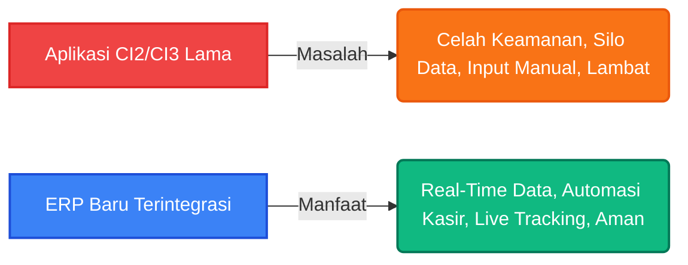

# 📄 Proposal Bisnis & Latar Belakang Migrasi ERP

**Kepada Yth. Dewan Direksi BCS Logistics**  
**Perihal: Dokumen Justifikasi Teknis dan Operasional Migrasi Sistem ke ERP Terintegrasi**

---

## 1. Ringkasan Eksekutif

Dalam industri logistik dan transportasi modern, efisiensi operasional, kecepatan pemrosesan data, keamanan informasi, dan akurasi keuangan adalah pilar utama daya saing perusahaan. Saat ini, operasional BCS Logistics didukung oleh sistem lama (*legacy systems*) yang dibangun di atas framework **CodeIgniter 2 (CI2)** dan **CodeIgniter 3 (CI3)**. 

Meskipun sistem tersebut telah berjasa mendukung pertumbuhan awal perusahaan, saat ini sistem tersebut telah mencapai batas kemampuan teknisnya (*technical debt*) dan mulai menghambat skalabilitas bisnis. Proyek pembangunan **ERP BCS Logistics** baru yang terintegrasi (menghubungkan modul Marketing, OCS, Kasir, dan FMS) dirancang untuk memitigasi risiko keamanan, memotong proses manual, dan menyajikan dasbor pengambilan keputusan yang bersifat *real-time* bagi Direksi.

---

## 2. Mengapa Sistem Lama (CI2 & CI3) Harus Ditinggalkan?

Teknologi informasi berkembang dengan cepat. Menggunakan sistem berbasis CI2 dan CI3 di tahun 2026 menimbulkan risiko bisnis yang kritis:

### A. Kerentanan Keamanan Kritis (*Security Risks*)
* **Depresiasi Versi PHP**: CodeIgniter 2 dan 3 didesain untuk berjalan pada versi PHP lama (PHP 5.x hingga PHP 7.x) yang saat ini **sudah mencapai status End-of-Life (EOL)**. Server hosting yang menjalankan PHP versi lama tidak lagi menerima patch keamanan. Hal ini membuat database transaksi pengiriman, data pelanggan, dan data keuangan rentan terhadap serangan siber, peretasan, kebocoran data, dan ransomware.
* **Kerentanan SQL Injection & XSS**: Framework CI2/CI3 versi lama memiliki banyak celah keamanan yang terdokumentasi secara publik. Penyerang dapat dengan mudah mengeksploitasi celah ini jika sistem dapat diakses secara publik dari internet.

### B. Silo Data & Kurangnya Integrasi (*Data Silo & Fragmentation*)
* Pada sistem lama, aplikasi berjalan secara parsial (terpisah-pisah). Staf Marketing harus menginput data secara manual ke sistem operasional, lalu Kasir melakukan input ulang untuk pembayaran UJO.
* Ketidaksesuaian (*mismatch*) data sering terjadi karena tidak adanya *Single Source of Truth*. Data tonase aktual dari tim operasional di lapangan seringkali terlambat divalidasi oleh tim keuangan, yang berujung pada keterlambatan penagihan (*invoice*) ke pelanggan.

### C. Keterbatasan Skalabilitas & Performa (*Scalability & Performance Bottlenecks*)
* Sistem CI2/CI3 tidak dirancang untuk menangani beban transaksi tinggi secara bersamaan (*high concurrency*), seperti pelacakan posisi GPS armada secara *real-time* (FMS), integrasi sensor BBM, dan sinkronisasi pembayaran digital kasir.
* Sistem lama tidak memiliki kemampuan bawaan untuk arsitektur modern (seperti WebSockets untuk pembaruan data instan tanpa refresh halaman).

### D. Tingginya Biaya Pemeliharaan (*High Maintenance Cost & Resource Scarcity*)
* Menemukan pengembang (*developer*) yang ahli dan mau memelihara kode CI2/CI3 semakin sulit dan mahal, karena industri telah beralih ke standar modern. 
* Kode pada sistem lama cenderung menjadi "Spaghetti Code" (tidak terstruktur dengan baik), sehingga setiap ada penambahan fitur kecil, sistem sering mengalami *error* di bagian lain.

---

## 3. Justifikasi Kebutuhan Sistem ERP Terintegrasi Baru

ERP baru yang dirancang di atas teknologi modern (seperti SvelteKit, modern Backend API, PostgreSQL) menawarkan solusi komprehensif terhadap tantangan bisnis BCS Logistics:

### 1. Integrasi Alur Kerja End-to-End (E2E) yang Mulus
Dengan ERP baru, satu siklus pengiriman terhubung secara otomatis:
* **Marketing** membuat Sales Order -> **OCS** menerima notifikasi untuk *assign* truk/driver -> **Kasir** langsung memproses pencairan UJO tanpa menunggu berkas fisik -> **Driver** jalan dipantau oleh **FMS** -> **Kasir** melakukan pelunasan biaya tambahan.
* Menghilangkan proses input berulang-ulang (*double input*), meminimalisir kesalahan manusia (*human error*), dan meningkatkan kecepatan operasional hingga **60%**.

### 2. Visibilitas Dasbor Direksi yang Akurat & Real-Time
Direksi tidak perlu lagi menunggu laporan mingguan atau bulanan secara manual. Lewat Dashboard Utama, Direksi dapat melihat secara langsung:
* Pendapatan aktif dan piutang pelanggan yang belum tertagih.
* Status utilisasi armada (berapa unit truk yang jalan, diservis, atau kosong).
* Margin keuntungan riil per rute pengiriman berdasarkan pengeluaran UJO aktual.

### 3. Keamanan Tingkat Tinggi & Kepatuhan Standar
* Menggunakan standar enkripsi modern dengan autentikasi berbasis token HTTP-only Cookie (`auth_token`), meminimalkan risiko pencurian sesi login.
* Database PostgreSQL yang tangguh untuk menjamin integritas data transaksi dan cadangan (*backup*) berkala yang aman.

---

## 4. Analisis Dampak Investasi (Impact & ROI Analysis)

| Aspek | Kondisi Sistem CI2 / CI3 Lama | Kondisi ERP Baru Terintegrasi | Dampak Finansial / Bisnis |
| :--- | :--- | :--- | :--- |
| **Kecepatan Penagihan** | Lambat, menunggu surat jalan fisik dicocokkan secara manual (3-7 hari). | Cepat, realisasi tonase langsung diinput setelah truk bongkar (real-time). | **Meningkatkan Arus Kas (Cash Flow)** perusahaan lebih cepat. |
| **Kebocoran Dana Jalan** | Rentan terjadi selisih pencatatan uang jalan (UJO) dan biaya tak terduga. | Tercatat ketat melalui validasi sistem Kasir berbasis status digital. | **Efisiensi Pengeluaran** dan audit instan terhadap pengeluaran kasir. |
| **Keamanan Sistem** | Sangat berisiko terkena serangan siber karena framework tidak di-update. | Menggunakan arsitektur aman dengan guard SvelteKit server-side. | **Menghindari Kerugian Finansial** akibat kehilangan atau sandera data siber. |
| **Pengambilan Keputusan** | Berdasarkan laporan manual Excel yang rentan kesalahan input. | Berdasarkan grafik visual Dashboard analitik real-time. | **Akurasi Strategi Direksi** dalam menambah atau merestrukturisasi rute bisnis. |

---

## 5. Kesimpulan & Rekomendasi

Mempertahankan sistem berbasis CodeIgniter 2 dan 3 adalah langkah yang berisiko tinggi secara teknis dan merugikan secara operasional dalam jangka panjang. Migrasi menuju **ERP BCS Logistics** baru bukan sekadar pembaruan perangkat lunak, melainkan **investasi strategis** untuk memperkuat fondasi bisnis, meningkatkan akurasi data keuangan, serta mempermudah Direksi dalam memimpin perusahaan dengan dukungan data yang valid dan real-time.

Dengan ini, direkomendasikan agar Direksi menyetujui implementasi penuh sistem ERP terintegrasi ini untuk menggantikan seluruh sistem lama.
