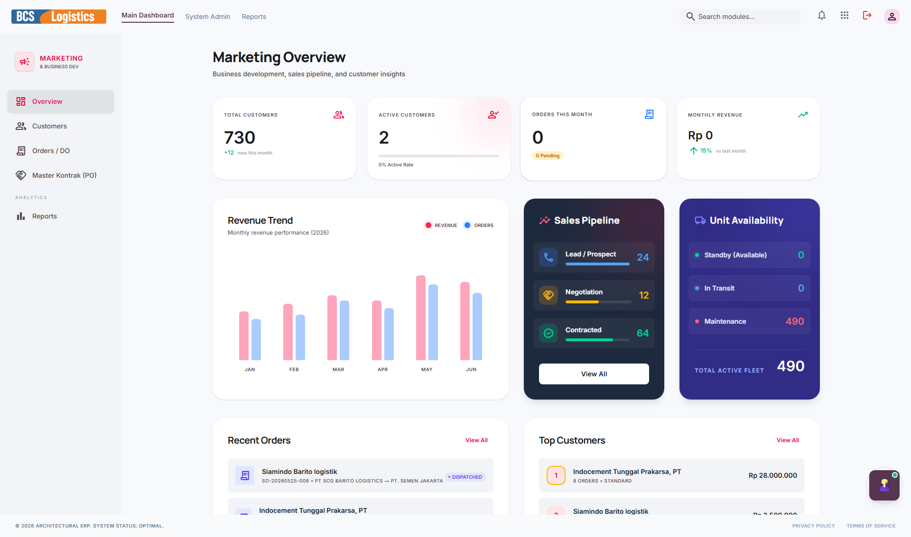
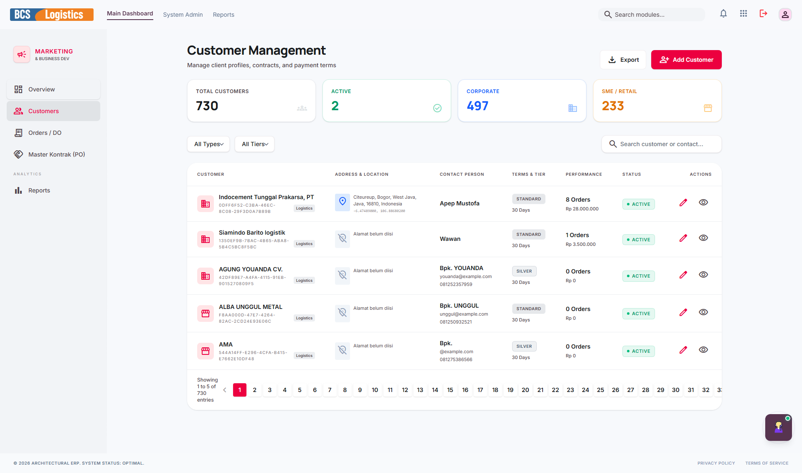
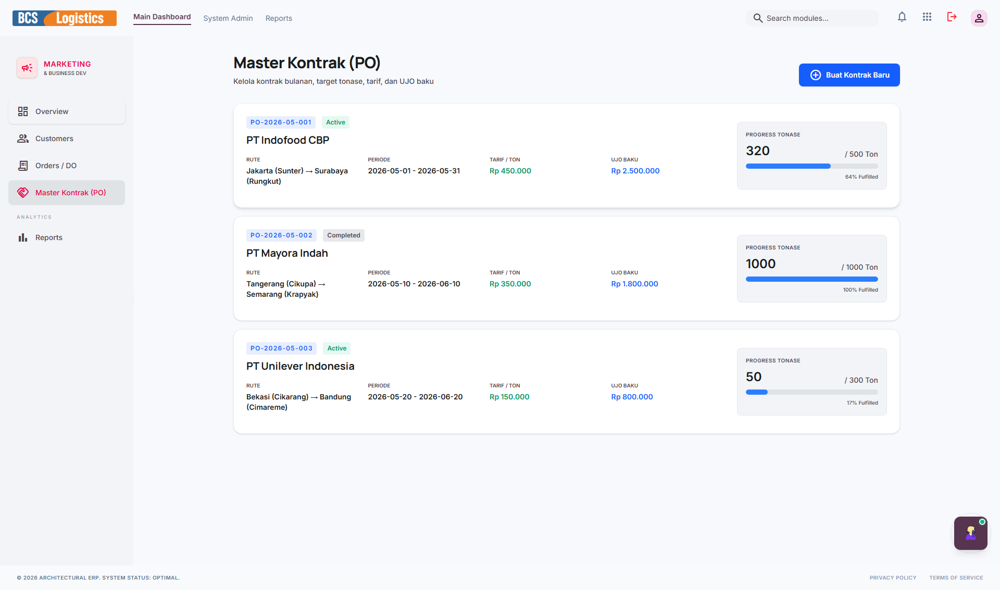
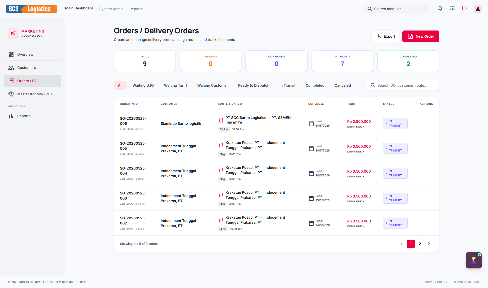
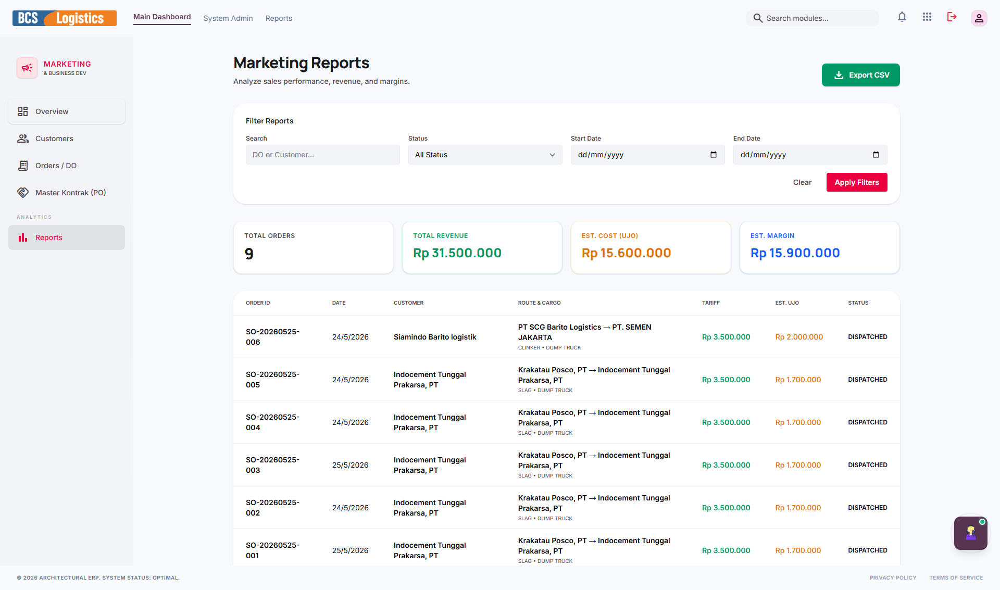

# 📢 Marketing (Growth Engine)

Modul **Marketing** (dikenal juga sebagai *Growth Engine*) bertanggung jawab untuk memfasilitasi seluruh proses interaksi dengan pelanggan (*Customer Relationship Management* atau CRM) serta manajemen penjualan. Fitur di dalamnya dirancang untuk mempermudah pendaftaran data pelanggan baru, pembuatan master kontrak jangka panjang, pencatatan Purchase Order (PO) dari klien, hingga penerbitan *Delivery Order* (DO) untuk dikirimkan oleh divisi operasional.

---

## 📸 Tampilan Utama Modul Marketing

Modul Marketing memiliki dasbor visual modern yang berfokus pada visualisasi performa penjualan dan hubungan dengan klien.

---

## 🧭 Menu dan Fitur Marketing

Modul Marketing memiliki navigasi sidebar yang terdiri dari menu-menu berikut:

### 1. Dashboard Overview
Menampilkan statistik pencapaian penjualan bulanan, total omset penjualan aktif, jumlah kontrak yang berjalan, serta grafik tren order pengiriman barang dari pelanggan.

---

### 2. Customers (Pelanggan)
Database lengkap mengenai pelanggan/klien perusahaan. Mencakup nama perusahaan pelanggan, alamat kantor, kontak person (PIC), NPWP untuk urusan perpajakan, serta riwayat interaksi bisnis dan jangka waktu kredit pembayaran (*Term of Payment* / TOP) yang disepakati.

---

### 3. Master Kontrak & PO Pelanggan
Menu untuk menyusun dan menyimpan surat perjanjian kontrak kerja sama jangka panjang (Master Contract) dengan pelanggan. Fitur ini juga digunakan untuk mengunggah dan mencatat dokumen Purchase Order (PO) resmi dari pelanggan sebagai dasar hukum pelaksanaan pengiriman barang.

---

### 4. Orders / DO (Delivery Order)
Menu pembuatan perintah pengiriman barang atau *Delivery Order* (DO) berdasarkan PO yang aktif. Di sini, staf marketing menentukan jenis barang yang akan dikirim, jumlah volume/tonase, rute tujuan pengiriman, dan jadwal pengiriman barang sebelum diteruskan ke tim operasional (OCS).

---

### 5. Reports (Laporan Penjualan)
Menghasilkan analisis komprehensif mengenai kontribusi penjualan per pelanggan, rute pengiriman yang paling aktif menghasilkan keuntungan, serta laporan efisiensi marketing untuk membantu direksi merumuskan strategi promosi dan ekspansi pasar berikutnya.

---

> [!NOTE]
> Setelah tim Marketing merilis **Delivery Order (DO)** di modul ini, data tersebut akan langsung masuk secara real-time ke dalam antrian modul **OCS (Operations Hub)** untuk dicarikan pengemudi dan armada truk yang sesuai.
