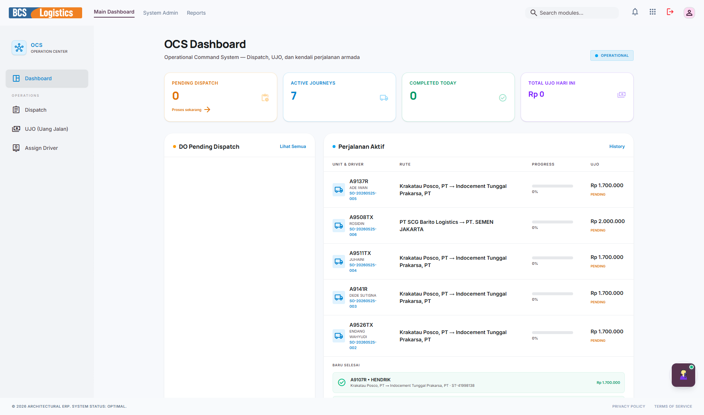
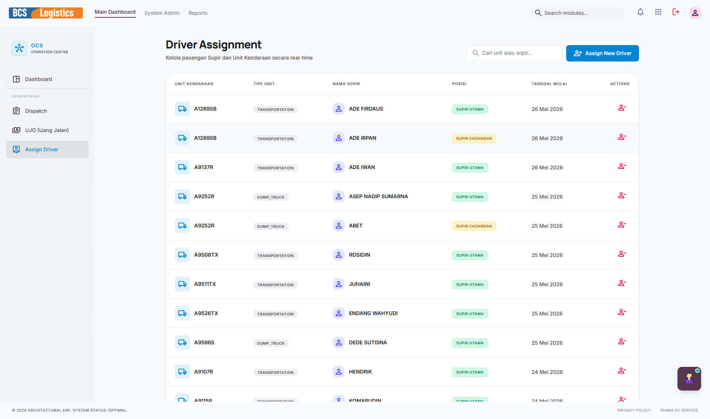
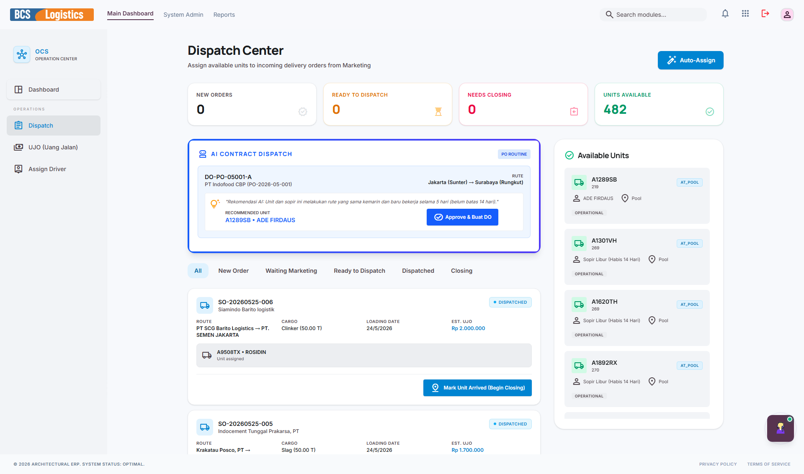
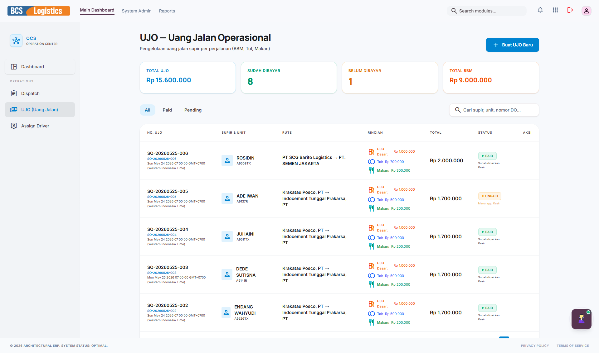

# 🌐 OCS (Operations Hub)

**Operations Hub (OCS)** merupakan pusat koordinasi harian tim operasional logistik. Aplikasi ini berfungsi untuk menjembatani order dari tim Marketing dengan kesiapan armada dari FMS. Tugas utama OCS meliputi penugasan pengemudi (*Assign Driver*), pembuatan perintah jalan (*Dispatch*), pemantauan status pengiriman barang secara real-time, hingga pengurusan pencairan Uang Jalan Operasional (UJO).

---

## 📸 Tampilan Utama Modul OCS

Antarmuka utama OCS menampilkan modul operasional yang berfokus pada kecepatan pemrosesan data perjalanan armada logistik.

---

## 🧭 Menu dan Fitur OCS

Modul OCS memiliki sidebar navigasi dengan menu-menu sebagai berikut:

### 1. Dashboard Operasional
Menyajikan status pengiriman barang hari ini (misalnya: *Pending Dispatch*, *In Transit*, *Delivered*), jumlah truk yang beroperasi, serta grafik pencapaian pengiriman mingguan.

---

### 2. Assign Driver (Penugasan Pengemudi)
Menu interaktif untuk mencocokkan pesanan pengiriman aktif dengan pengemudi dan armada truk yang berstatus *Available* (tersedia). Tim OCS dapat memilih driver yang tepat berdasarkan kecocokan rute dan sisa kapasitas muat truk.

---

### 3. Dispatch (Pengiriman)
Pusat kontrol perintah jalan. Di menu ini, admin operasional merilis surat perintah jalan resmi (*Dispatch Order*). Menu ini juga merekam data penting seperti waktu keberangkatan truk dari gudang asal, waktu bongkar muat, dan konfirmasi barang telah sampai di tangan pelanggan.

---

### 4. UJO (Uang Jalan Operasional)
Menu untuk menetapkan, memvalidasi, dan menyetujui nominal dana operasional perjalanan driver (Uang Jalan Sopir atau UJO) berdasarkan rute dan jenis kendaraan. Data ini nantinya secara otomatis dikirim ke modul **Kasir** untuk segera dicairkan sebelum driver berangkat.

---

> [!NOTE]
> Kerja sama antara **OCS** dan **FMS** memastikan perjalanan armada termonitor dengan baik, meminimalisir keterlambatan pengiriman barang ke pelanggan.
