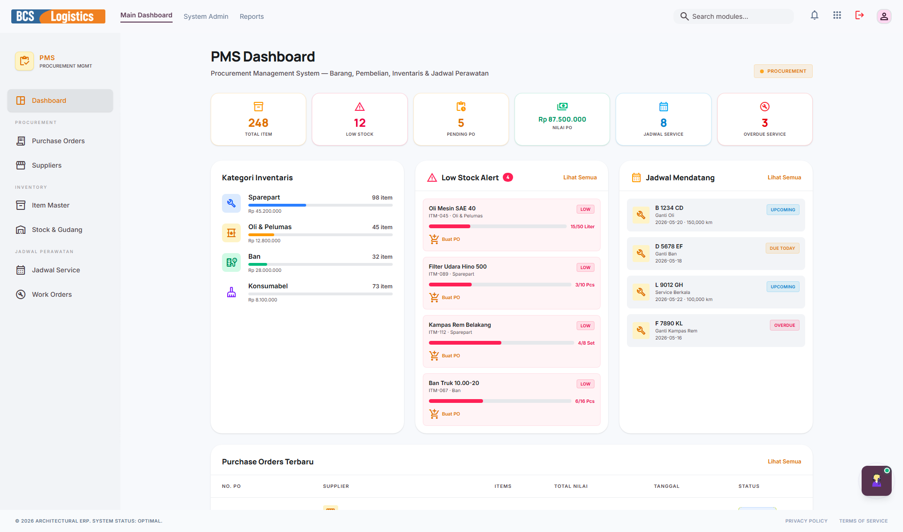
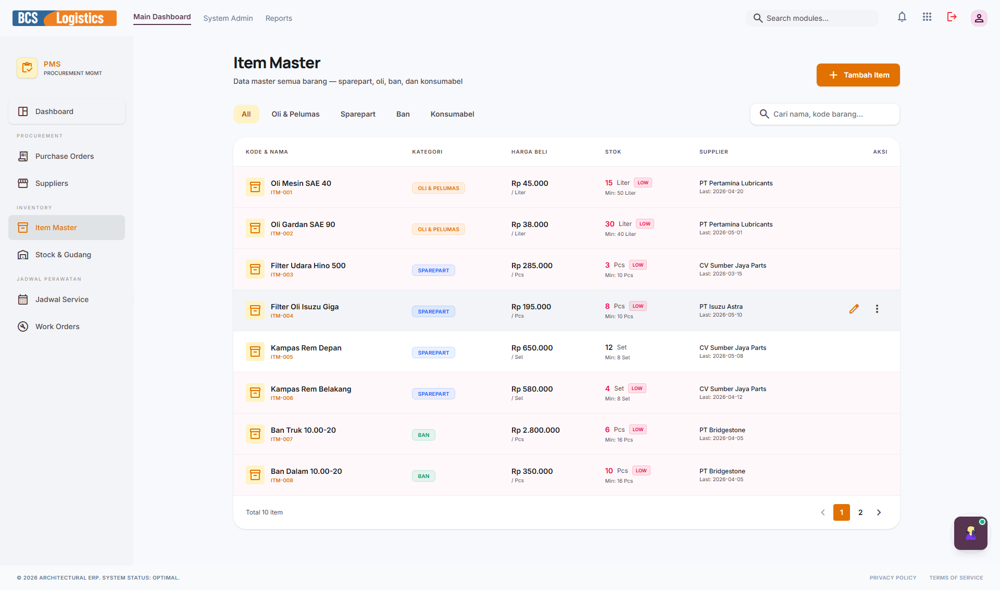
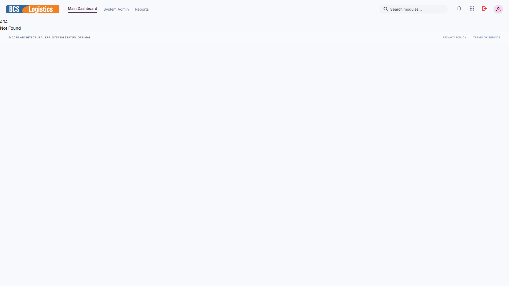
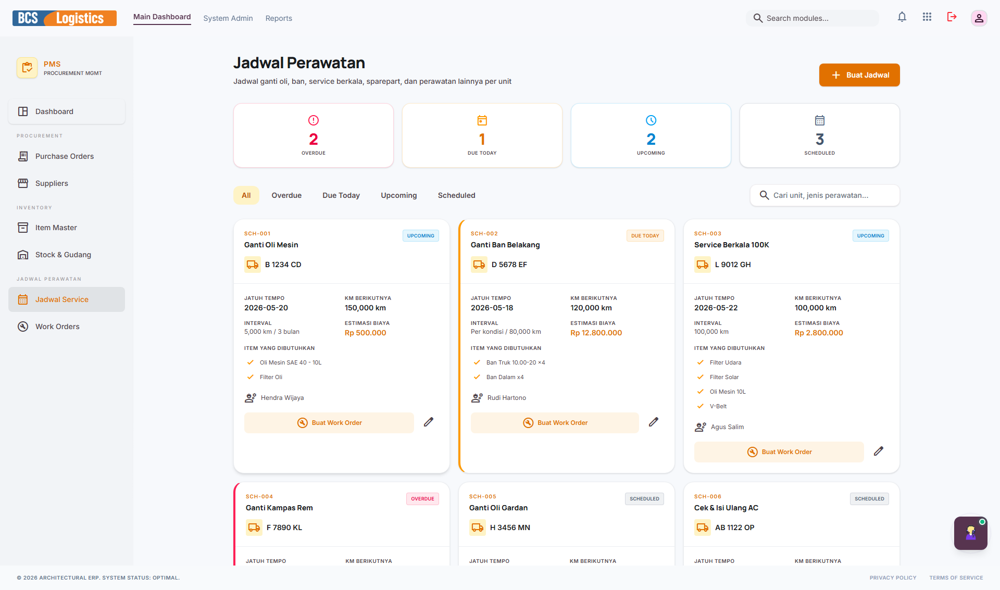

# 📦 PMS (Procurement Management System)

Modul **Procurement Management System (PMS)** bertanggung jawab terhadap seluruh rantai pasok (*supply chain*) perusahaan, mulai dari pembelian suku cadang armada (ban, oli, accu), pengelolaan persediaan di gudang (inventory control), pemeliharaan peralatan internal, hingga pendaftaran daftar pemasok (*Suppliers*) terpercaya.

---

## 📸 Tampilan Utama Modul PMS

Halaman depan PMS menyajikan data terpadu untuk memantau status pembelian barang kebutuhan operasional.

---

## 🧭 Menu dan Fitur PMS

Modul PMS memiliki navigasi sidebar kiri yang terdiri dari menu-menu berikut:

### 1. Dashboard Procurement
Menyajikan status pengajuan pembelian barang (*Purchase Requisition*), jumlah Purchase Order (PO) yang sedang menunggu pengiriman dari pemasok, status stok kritis, dan total biaya pengadaan barang bulan ini.

---

### 2. Purchase Orders (PO Pengadaan)
Mengelola proses pembuatan dan persetujuan dokumen Purchase Order (PO) resmi untuk dikirimkan ke Pemasok. Menu ini melacak status PO mulai dari dikirim (*Sent*), sedang dikirim (*On Delivery*), hingga barang diterima di gudang (*Received*).

---

### 3. Suppliers (Pemasok)
Direktori pemasok/mitra bisnis penyedia barang dan jasa kebutuhan perusahaan. Berisi data lengkap profil perusahaan pemasok, jenis barang yang disuplai, kontak person, rekam jejak pengiriman (*performance rate*), serta kesepakatan tempo pembayaran.

---

### 4. Item Master (Master Barang)
Katalog tunggal yang memuat semua jenis barang yang dibeli dan disimpan di gudang perusahaan (suku cadang truk, ATK kantor, ban, oli, dll.). Setiap barang dilengkapi dengan kode unik (SKU), satuan ukur (Unit), serta batas minimal stok aman (*reorder point*).

---

### 5. Stock & Gudang (Stok Gudang)
Menu pelacakan kuantitas stok barang aktual di gudang secara real-time. Membantu melakukan opname stok berkala, pencatatan mutasi barang masuk/keluar gudang, serta melacak kartu stok secara transparan untuk menghindari selisih stok fisik.

---

### 6. Jadwal Service (Pemeliharaan Aset Gudang)
Mengelola jadwal servis dan pemeliharaan untuk aset-aset tetap perusahaan selain armada jalan raya (misalnya: perawatan kompresor angin bengkel, servis forklift gudang, AC kantor, genset, dll.) guna memastikan seluruh peralatan operasional bekerja optimal.

---

### 7. Work Orders (Perintah Kerja Bengkel)
Menu pembuatan instruksi kerja (Work Order) untuk tim mekanik bengkel internal perusahaan. Digunakan untuk merinci kerusakan kendaraan, menentukan mekanik yang bertugas, serta mendaftar suku cadang apa saja yang harus dikeluarkan dari gudang persediaan PMS untuk dipasang pada armada truk.

---

> [!TIP]
> Ketika suku cadang diambil dari gudang untuk dipasang pada truk lewat **Work Order**, sistem PMS akan memotong stok gudang secara otomatis dan mencatat biayanya sebagai beban pemeliharaan armada bersangkutan di modul **FMS**.
