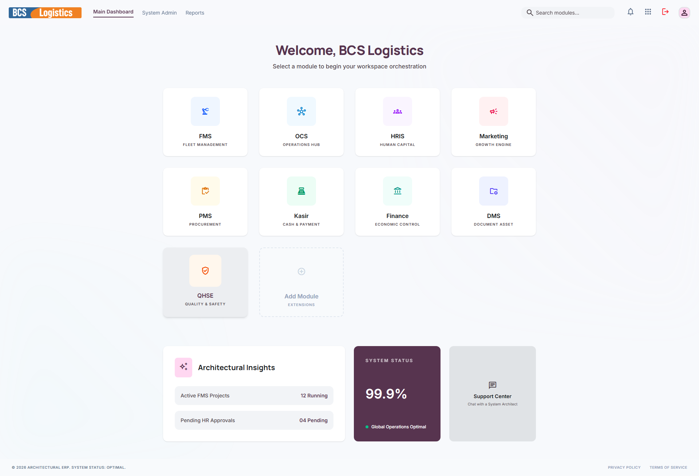

# 🛡️ QHSE (Quality & Safety)

Modul **QHSE (Quality, Health, Safety, and Environment)** atau **Kualitas & Keselamatan** adalah bagian krusial dalam operasional logistik berskala besar. Modul ini berfokus pada pengendalian mutu pelayanan perusahaan, penerapan standar kesehatan dan keselamatan kerja (K3), pemeliharaan lingkungan hidup di area kerja, serta manajemen sertifikasi dan audit keselamatan armada logistik.

---

## 📸 Tampilan Utama Modul QHSE

Modul QHSE menampilkan portal pemantauan kepatuhan standar keselamatan kerja dan mutu pelayanan bisnis.

---

## 🧭 Menu dan Fitur QHSE

Modul QHSE memiliki fungsionalitas utama yang mencakup aspek-aspek berikut:

### 1. Safety Dashboard (Dashboard Keselamatan)
Memantau status audit K3 berkala, masa berlaku sertifikasi keselamatan (seperti ISO 9001, ISO 14001, ISO 45001), rekapitulasi pelaporan kecelakaan kerja harian, serta grafik kepatuhan standar APD (*Alat Pelindung Diri*) karyawan di lapangan.

---

### ⚙️ Aspek Utama dalam QHSE:
* **Manajemen Kepatuhan APD**: Memastikan setiap pengemudi (driver) dan mekanik bengkel menggunakan perlengkapan keselamatan standar (helm, sepatu safety, rompi reflektif) sebelum bertugas.
* **Audit Keselamatan Armada**: Berkolaborasi dengan modul **FMS** untuk melakukan inspeksi kelayakan jalan armada secara acak (*ramp check*) demi mendeteksi dini kendala teknis rem, lampu, ban, dan kemudi.
* **Pelaporan dan Investigasi Insiden**: Formulir terstruktur untuk menginvestigasi secara mendalam penyebab insiden kecelakaan di lapangan untuk merumuskan langkah pencegahan agar kejadian serupa tidak terulang kembali di masa depan.
* **Sertifikasi Layak Jalan & Emisi**: Memastikan sertifikasi lulus uji emisi ramah lingkungan dan kepatuhan hukum dari Dinas Perhubungan setempat selalu diperbarui tepat waktu.
